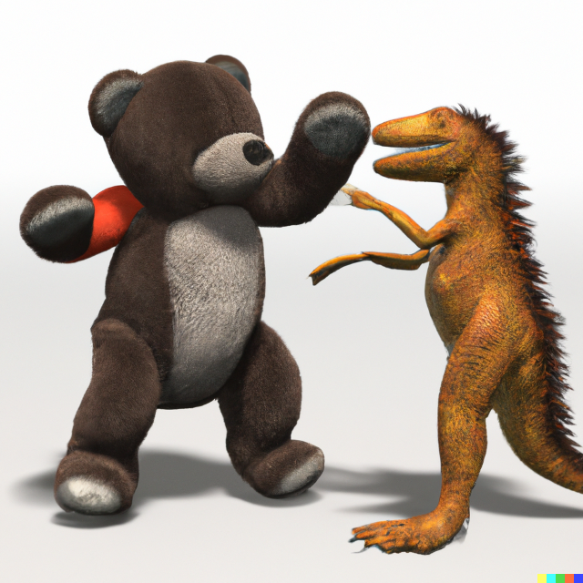
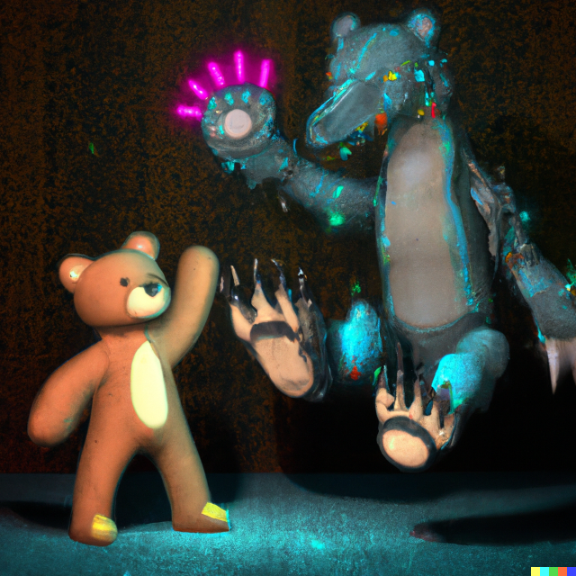
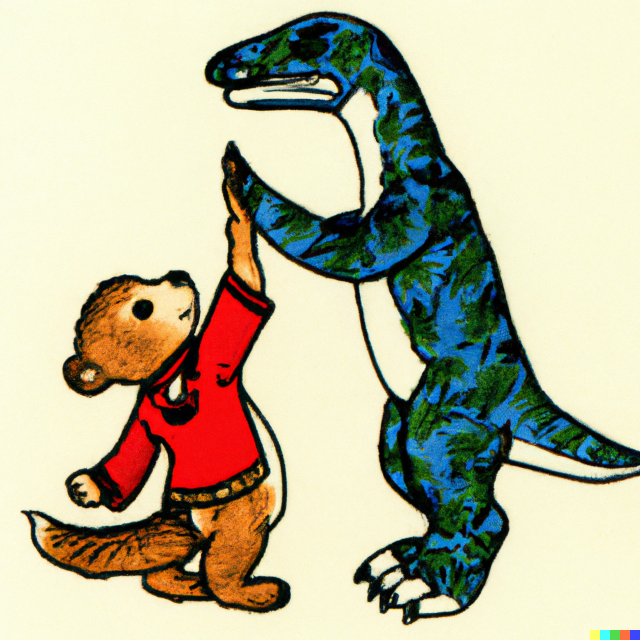

# Testing 68 different artistic styles with OpenAI Dall-E 2
This repository is a complement to the (Web) Story published on my website: ["Taddy & Rapty, a friendship in 68 artistic styles, using AI"](https://yannickhuchard.com/?post_type=web-story&p=545).
 

## Prompt
The prompt used is _"A Teddy bear doing a high five with a velociraptor, &lt;name of artistic style&gt;"_.
 

## Image Samples:

 
All images are in the folder /images_640x640
 
 

## Data: List of Artistic Styles
You will find the list of artistic styles used for generating the images as:
- JSON
- CSV (UTF-8)
- XLSX 
- CQL for Neo4J (Desktop) 

 
🫡
 
Yannick HUCHARD